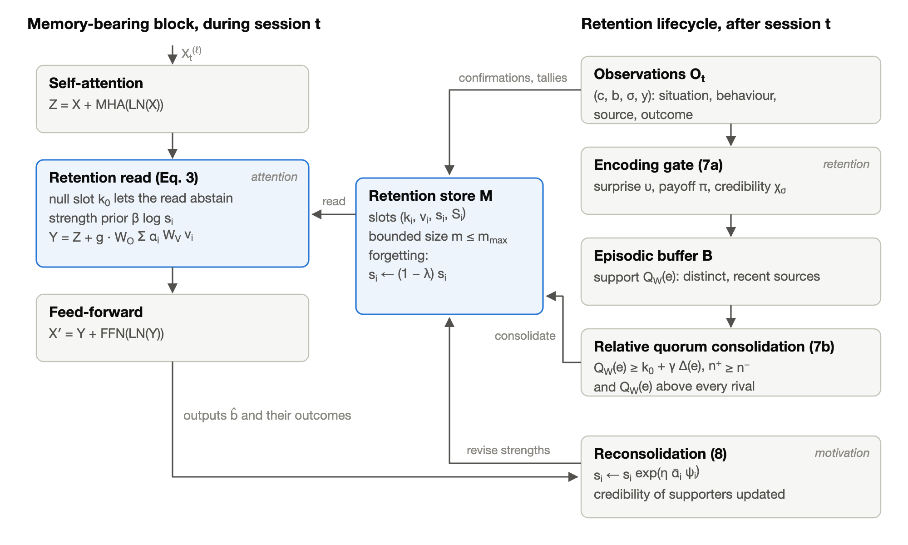
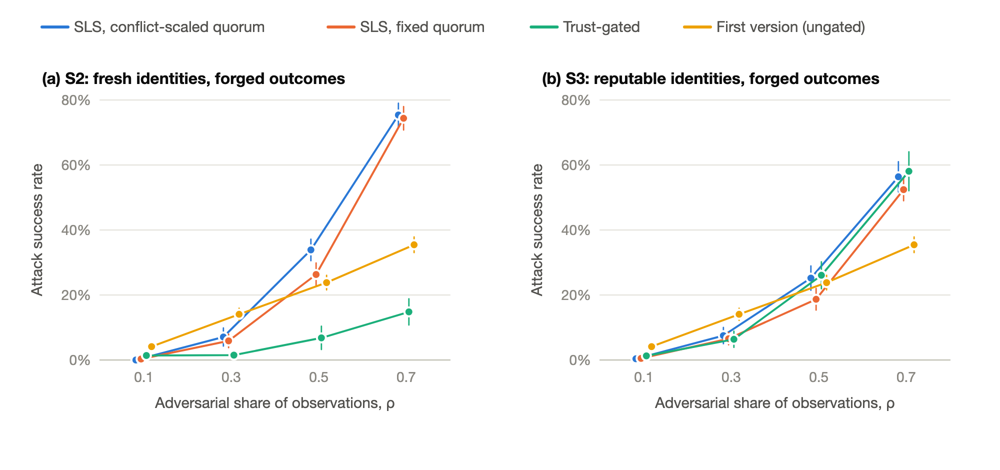

# Retention Layer

[](https://doi.org/10.5281/zenodo.22758216)

Simulation code, raw results and figures for the paper *Attention Is All You Need Until You Need Retention* by M. Murat Yaslioglu.

Version 1 of the paper, posted in January 2025, is [arXiv:2501.09166](https://arxiv.org/abs/2501.09166). It proposed a Retention Layer: a persistent memory that a Transformer block reads with attention and writes during use. This repository accompanies the revised version, subtitled *Governing Persistent Transformer Memory with Social Learning Strategies*, which is being prepared as arXiv version 2. Section, table and figure numbers below refer to that revision.



## What the revision adds

Most of what a deployed model could keep is produced by other agents: users, documents, tools and other models. The revision treats the question of what to retain as a social learning problem and derives the memory lifecycle from social learning strategies.

- Encoding is gated by surprise (copy when uncertain), by observed outcomes (payoff bias) and by the credibility that sources earn through past success (prestige bias).
- Consolidation follows conformist transmission. A behaviour becomes durable only when the credibility-weighted support of distinct, recent sources reaches a quorum and exceeds the support for every rival behaviour, including the one the model already produces.
- Reconsolidation strengthens or weakens stored entries according to the outcomes of reproducing them, and entries that go unused decay.

The paper proves that raising the quorum lowers the risk of consolidating a coordinated false template exponentially while delaying true templates only linearly. It also shows that relative consolidation protects only while credible honest evidence arrives faster than adversarial evidence.

## What the simulation is and is not

`sls_retention_sim.py` is a mechanism-level proof of concept. Situations are noisy key vectors, behaviours are template embeddings, and a frozen prior over templates stands in for pretrained weights. The correct behaviour changes for some situations halfway through the run, and three attack models push a false template for 20 target situations. The simulation checks whether the read, write, consolidation, reconsolidation and forgetting operators behave as specified when their inputs are given. It does not show that a language model can compute those inputs. Section 7 of the paper describes the experiments needed for that.

## Contents

| Path | Contents |
|:---|:---|
| `sls_retention_sim.py` | The simulation. Needs only NumPy. |
| `make_figures.py` | Draws Figures 1 to 4 as SVG from a results file and exports PNG with headless Chrome or Chromium. |
| `results/results.json` | The full run reported in the paper (20 seeds), with the quorum and adversarial-share sweeps and the numerical checks of Propositions 1 and 2. |
| `results/results_v0_absolute_quorum.json` | An earlier lifecycle that failed against forged outcomes, kept for transparency (see below). |
| `figures/` | Figures 1 to 4 as SVG and PNG. |

## Running the code

You need Python 3.10 or later and NumPy.

```bash
git clone https://github.com/myaslioglu/retention-layer.git
cd retention-layer
python3 -m pip install -r requirements.txt

# smoke test with 2 seeds and 2,000 steps
python3 sls_retention_sim.py --quick --out results_quick.json

# full run reported in the paper, then the figures
python3 sls_retention_sim.py --seeds 20 --out results/results.json
python3 make_figures.py results/results.json figures
```

The full run took about 100 seconds with 8 worker processes on an 8-core Apple silicon laptop. Set `--workers` to match your machine. The script prints summary tables and writes per-policy means, 95% confidence half-widths and evaluation curves to the results file. For a given seed every policy sees the same event stream, so differences between policies are paired.

`results/results.json` was produced with Python 3.14.7 and NumPy 2.5.3 on macOS (arm64). Reruns with other NumPy or BLAS builds may differ slightly from the reported values.

`make_figures.py` looks for a browser in the `CHROME` environment variable, then at the default Google Chrome location on macOS, then for `google-chrome`, `google-chrome-stable`, `chromium` or `chromium-browser` on `PATH`. If it finds none, it writes the SVG files and skips the PNG export.

```bash
CHROME=/usr/bin/chromium python3 make_figures.py results/results.json figures
```

## Main results

Final means over 20 seeds when 30% of the observations about each target situation are adversarial (Table 3 of the revised paper). S0 has no attacker. In S2 the attacker uses a fresh identity for every injection and reports success for its own demonstrations. In S3 five identities with strong reputations carry all injections and report success.

| Policy | S0 accuracy | S0 accuracy, drifted situations | S2 attack success | S3 attack success |
|:---|---:|---:|---:|---:|
| First version (ungated) | 0.633 | 0.415 | 0.141 | 0.141 |
| Surprise-gated | 0.843 | 0.700 | 0.181 | 0.181 |
| Trust-gated | 0.794 | 0.019 | 0.015 | 0.064 |
| SLS, fixed quorum | 0.996 | 0.958 | 0.059 | 0.066 |
| SLS, conflict-scaled quorum | 0.992 | 0.910 | 0.071 | 0.075 |

The trust-gated policy matches or beats SLS on attack success, but it fails on drifted situations (0.019) because it keeps reinforcing the old behaviour. Conformity also works against the SLS lifecycle once the adversary is faster. At an adversarial share of 0.7 in S2, attack success for SLS with a fixed quorum is 0.744, against 0.354 for the first version (Figure 4).



## The earlier lifecycle

An earlier version of the lifecycle had no confirmations, no tallies and no relative condition. Its surprise gate ignored confirmations of behaviour the model already produced but admitted every contradiction, so an adversary that forged outcomes collected support that honest sources were never credited with. It failed against forged outcomes, and the current components were added in response. `results/results_v0_absolute_quorum.json` keeps that run. The `sls_no_confirmation` ablation in the current code is its closest equivalent. The numbers differ slightly because consolidation now counts each source once when entries are merged.

## Citation

Please cite the paper. Until version 2 is posted, cite the arXiv preprint:

```bibtex
@misc{yaslioglu2025attention,
  author        = {Yaslioglu, M. Murat},
  title         = {Attention is All You Need Until You Need Retention},
  year          = {2025},
  eprint        = {2501.09166},
  archivePrefix = {arXiv},
  doi           = {10.48550/arXiv.2501.09166}
}
```

To cite the code, use its Zenodo archive. The concept DOI [10.5281/zenodo.22758216](https://doi.org/10.5281/zenodo.22758216) always resolves to the latest version. Version 1.0.0, which produced the results reported in the paper, has its own DOI, [10.5281/zenodo.22758217](https://doi.org/10.5281/zenodo.22758217).

```bibtex
@software{yaslioglu2026retentioncode,
  author    = {Yaslioglu, M. Murat},
  title     = {Retention Layer: simulation code and results},
  version   = {v1.0.0},
  year      = {2026},
  publisher = {Zenodo},
  doi       = {10.5281/zenodo.22758217}
}
```

`CITATION.cff` gives the paper reference through the "Cite this repository" button on GitHub.

## License

GNU General Public License v3.0. See [LICENSE](LICENSE).

## Author

M. Murat Yaslioglu, Istanbul University, School of Business. ORCID [0000-0003-2464-5439](https://orcid.org/0000-0003-2464-5439)
